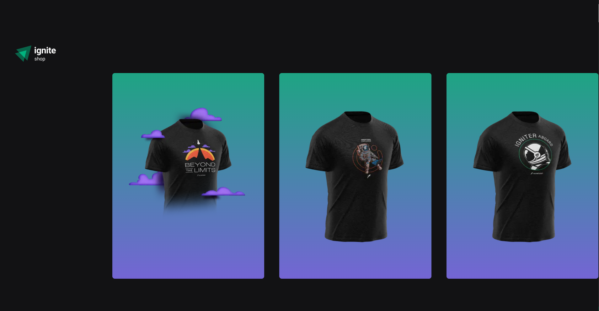
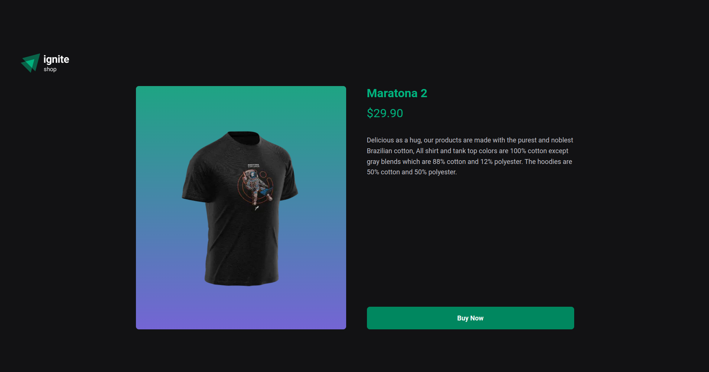
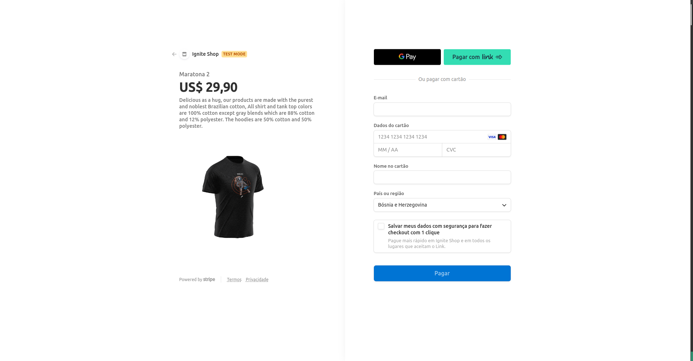
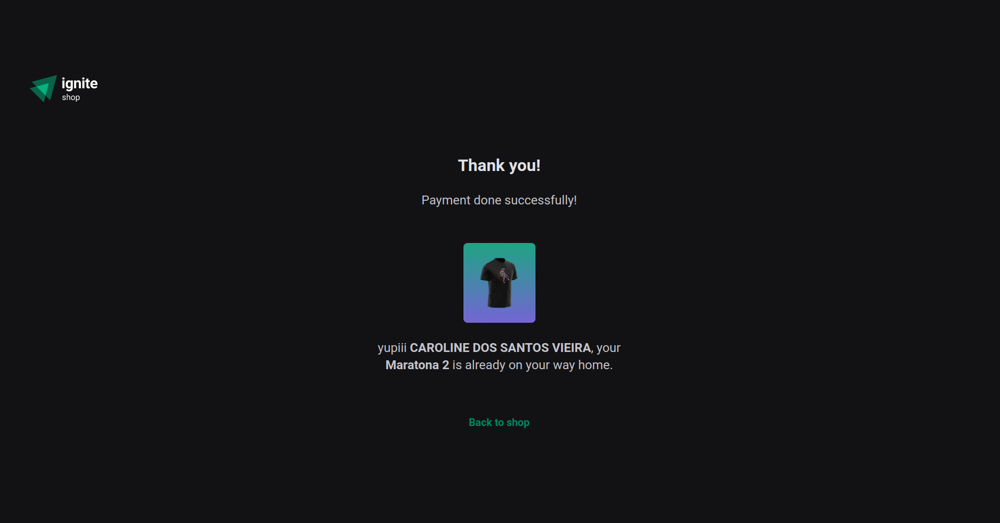

<p align="center" id="top">
    
</p>

<br>

<p align="center">
  <a href="#technologies">Technologies</a>&nbsp;&nbsp;&nbsp;|&nbsp;&nbsp;&nbsp;
  <a href="#project">Project</a>&nbsp;&nbsp;&nbsp;|&nbsp;&nbsp;&nbsp;
  <a href="#-layout">Layout</a>&nbsp;&nbsp;&nbsp;|&nbsp;&nbsp;&nbsp;
</p>
<br>

<p align="center">
	
	
	
	
</p>

---

<br>

## Technologies ##

This project was developed using the following technologies:

- [React](https://pt-br.reactjs.org/)
- [NextJS](https://nextjs.org/)
- [TypeScript](https://www.typescriptlang.org/)
- [Stitches](https://stitches.dev/)
- [Keen-slider](https://keen-slider.io/)
- [Stripe](https://stripe.com/pt-br-us)
- [Axios](https://axios-http.com/docs/intro)


<br>

---

## 📋  Requirements ##

Before starting you need :checkered_flag:, have installed the [Git](https://git-scm.com) e [Node](https://nodejs.org/en/).

<br>

---
## ⌨ How to run the project ##

```bash
# Clone this project
$ git clone git@github.com:Ca-byte/ignite_shop.git

# Access
$ cd ignite-dt-money

# Install dependencies
$ npm i

# Run the project
$ npm run dev

# The server will initialize in the <http://localhost:3000/>

```
<br>

---

## Project ##

The project idea is a shopping market, we learned about the main concepts around NextJS, understand the differences between SPA (single-page applications), SSR (server-side rendering), and SSG (static site generation), and understand mainly how this helps us from the usability of the application to the indexing of our app, how works fonts, images, navigation using Link, data fetching in next project, we used Stripe api for products and checkout.

This is a project developed during React bootcamp **[Ignite](https://github.com/Rocketseat)**, run by **[@Rocketseat](https://github.com/Rocketseat)**.

<br>

---

## 🔖 Layout ##

- [Ignite Shop](https://www.figma.com/file/86tpso6bhhvMwMenqngqJy/Ignite-Shop-(Copy)?node-id=0-1&t=Kn84RHroDvQRwtHL-0)

Remembering that you need to have a [Figma](http://figma.com/) account to access it.

---


<br>
<p align="center">Developed with 💜 by Caroline Vieira</p>

<a href="#top">☝</a>
